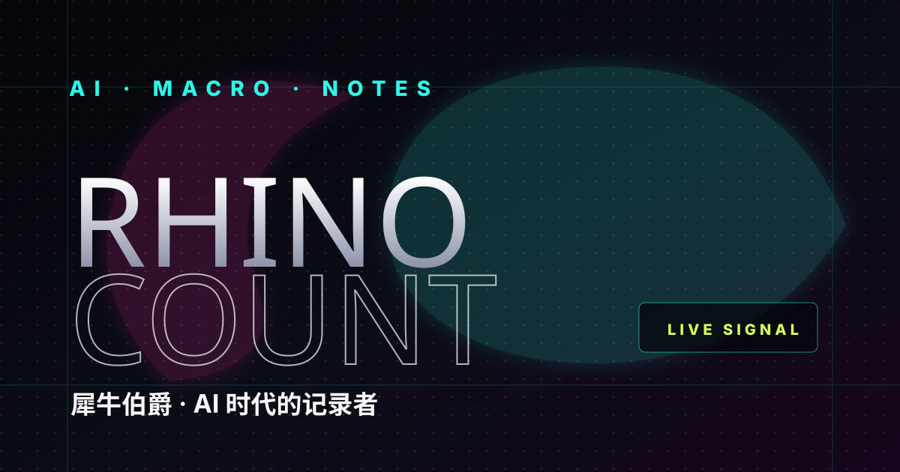

<div align="center">
  
  <h1>犀牛伯爵 · AI 创作实验室</h1>
  <p><strong>Build · Write · Think · Ship</strong></p>
  <p>北大本科 / 高考数学满分 / AI 大厂从业者 / 50000+ 粉丝创作者</p>
</div>

---

> 输出不是作品的全部。真正的工作，发生在观察、判断、拆解和反复迭代里。
> — 犀牛伯爵 · 2026

## 🔭 这是什么

一个 **AI-native 内容实验室**——不是一个博客，而是一套可持续运转的个人创作系统。用 Agent 工作流把观察、写作、产品实验和自动化串联起来，让每一次输出都变成可复用的资产。

## ✨ 核心板块

| 板块 | 内容 | 产出节奏 | 链接 |
|------|------|----------|------|
| 📰 **每日时评** | 宏观 · 地缘 · 科技产业信号解读 | 每晚 7 点自动生成 | [进入 →](https://zjeep-arch.github.io/rhino-count-site/articles/) |
| ☀️ **AI 早报** | 大模型 / 产品 / 资本 / 产业每日速览 | 每天 8 点自动生成 | [进入 →](https://zjeep-arch.github.io/rhino-count-site/ai-daily/) |
| 📝 **AI 笔记** | Agent 思维、学习方法、大厂手记、踩坑实录 | 持续更新 | [进入 →](https://zjeep-arch.github.io/rhino-count-site/#notes) |
| 🎮 **互动实验** | 轻量游戏化内容，测试表达新形态 | 随灵感产出 | [进入 →](https://zjeep-arch.github.io/rhino-count-site/games/duck-scare-war.html) |
| 📚 **产品教程** | DuMate 从 0 到 1 上手指南 | 不定期 | [进入 →](https://zjeep-arch.github.io/rhino-count-site/dumate/) |

## 📊 数据

- **时评文章**：15+ 篇（持续增长中）
- **AI 早报**：3+ 期（每日更新）
- **深度笔记**：7 篇
- **全平台粉丝**：50000+
- **全平台点赞**：10000+

## 🔥 精选内容

| 类型 | 作品 | 为什么值得读 |
|------|------|-------------|
| Essay | [Agent 不是产品，是新一代操作系统](https://zjeep-arch.github.io/rhino-count-site/notes/agent-is-operating-system.html) | 从 App 思维迁移到 Agent 思维需要的 5 个转变 |
| Essay | [当大模型开始替你思考，先学会问对问题](https://zjeep-arch.github.io/rhino-count-site/notes/prompt-is-the-skill.html) | 为什么 Prompt 是 2026 年最被低估的核心技能 |
| Essay | [用 Agent 写代码三个月，省下的时间都去哪儿了？](https://zjeep-arch.github.io/rhino-count-site/notes/agent-coding-three-months.html) | Agent 编程实践的真实代价与收益 |
| Commentary | [全世界都在砸钱建算力，但最赚的偏偏不是建算力的人](https://zjeep-arch.github.io/rhino-count-site/articles/2026-07-01-global-compute-war.html) | 全球算力军备竞赛的底层逻辑 |
| Commentary | [巴菲特接班人百亿砸 AI 基建——不是"追涨"，是"抄底"](https://zjeep-arch.github.io/rhino-count-site/articles/2026-06-23-berkshire-google-ai-infra.html) | 价值投资者重仓 AI 的产业周期判断 |
| Brief | [Anthropic 估值 9650 亿超 OpenAI + WAIC 2026 定档](https://zjeep-arch.github.io/rhino-count-site/ai-daily/2026-06-30-anthropic-965b-waic-2026.html) | AI 行业每日关键信号 |
| Guide | [百度 DuMate 从 0 到 1 上手教程](https://zjeep-arch.github.io/rhino-count-site/dumate/) | 把一个 AI 产品拆成可操作、可复用的教程资产 |
| Game | [鸭骗战争：真鸭假鹅](https://zjeep-arch.github.io/rhino-count-site/games/duck-scare-war.html) | 用轻量游戏化测试内容表达的新形态 |

## 🏗 技术架构

```text
rhino-count-site/
├── index.html                # 首页：单页应用，包含所有板块入口
├── data.js                   # 全站配置文件（唯一需要改的文件）
├── articles/                 # 每日时评（自动生成 + feed.json 驱动）
│   ├── index.html            # 列表页（分页加载，每页 10 篇）
│   ├── feed.json             # 文章列表数据源
│   └── template.html         # 文章模板
├── ai-daily/                 # AI 早报（自动生成 + feed.json 驱动）
│   ├── index.html            # 列表页（分页加载，每页 8 篇）
│   ├── feed.json             # 早报列表数据源
│   └── template.html         # 早报模板
├── notes/                    # AI 笔记与方法论文章
├── games/                    # 互动内容实验
├── dumate/                   # AI 产品教程
├── assets/                   # 首屏视频、卡片图和视觉素材
└── sitemap.xml               # SEO 站点地图
```

**技术特点：**
- 纯静态站点，零后端依赖，GitHub Pages 直接部署
- `feed.json` 驱动动态内容，支持 cron 自动生成
- 分页加载，50 篇和 500 篇体验一致
- 支持 light/dark 主题切换
- 响应式设计，移动端适配

## ⚡ 快速使用

```bash
# 本地预览
cd rhino-count-site
python3 -m http.server 8080
# 打开 http://localhost:8080

# 修改内容：编辑 data.js
# 新增时评：放入 articles/ 并更新 articles/feed.json
# 新增早报：放入 ai-daily/ 并更新 ai-daily/feed.json
# 新增笔记：放入 notes/ 并在 data.js 的 journal.notes 中添加
```

## 📈 创作路线图

- [x] 每日时评自动生成系统（cron + feed.json）
- [x] AI 早报自动生成系统
- [x] 列表页分页加载
- [ ] AI 笔记列表页独立化（从 data.js 迁移到 feed.json 驱动）
- [ ] 全站搜索功能
- [ ] 按月份/分类归档
- [ ] 更多 AI workflow playbook

## 🔗 全平台链接

- 🌐 **个人站**：[zjeep-arch.github.io/rhino-count-site](https://zjeep-arch.github.io/rhino-count-site/)
- 📱 **小红书**：[犀牛伯爵](https://www.xiaohongshu.com/user/profile/60572004000000000101ce41)（50000+ 粉丝）
- 🐦 **Twitter**：[@rhinocount](https://twitter.com/rhinocount)
- 💻 **GitHub**：[zjeep-arch](https://github.com/zjeep-arch)

---

<div align="center">
  <p><strong>© 2026 犀牛伯爵 · AI Creation Lab</strong></p>
  <p>如果这个项目对你有启发，欢迎 ⭐ Star</p>
</div>
